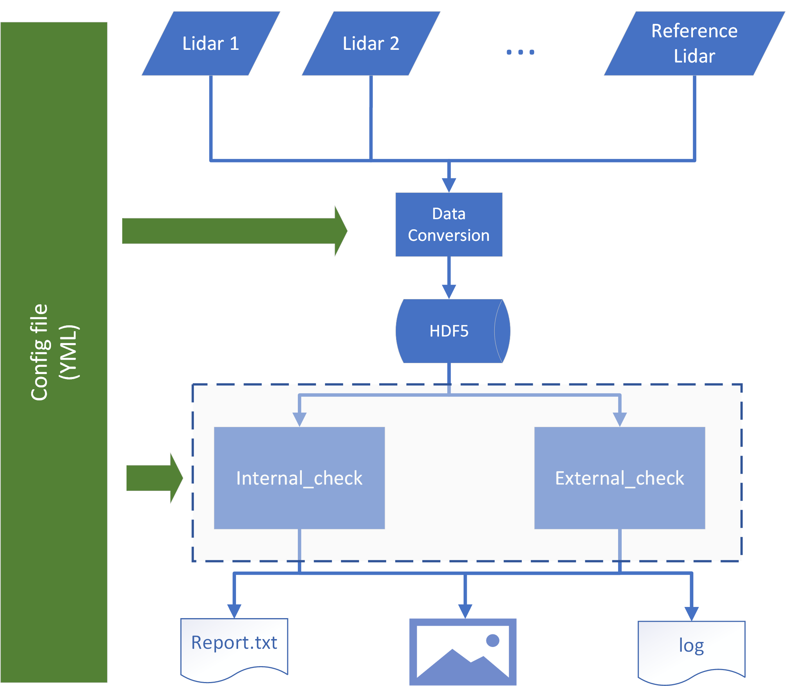

# Atmospheric Lidar Intercomparison Evaluator Software

This repository includes code for analyzing atmospheric lidars within China Meteorological Administration (CMA) Lidar Network. Main features are:

- Data Conversion
- Data Preprocessing
- Internal Validation (internalChk)
- External Comparison (externalChk)

> **Matlab (b2017)**. We will not take care of bugs running under lower version of Matlab.

## Download

You can download the code by [**Git**][1].

```bash
cd {/path/to/work_directory}
git clone https://gitee.com/mualidar/cma-lidar-comparison
```

## Update

The repository is under maintenance. New features and bug fixes would be applied. We recommend to use the latest version of the code base. You can update the code by the command below

```bash
cd {/path/to/work_directory/cma-lidar-comparison}
git pull origin master
```

## Usage

<p align='center'>

<br>
<b>Structure of the code</b>

The functionality of the code is guided by the configuration file, which is a [YAML][2] format file. With different configurations, the code can do internal validation or external comparison or both. See the example below,

```matlab
cd {/path/to/work_directory/cma-lidar-comparison}
setupLEToolbox   % include the code into the matlab search directories

LEMain('/path/to/configFile', 'flagReadData', true, 'flagQL', true, 'flagDebug', false);   % show lidar quicklooks
% Regarding the usage of LEMain, you can check by type in `help LEMain`

%    % Usecase 1: make quicklook (lidar quicklook)
%    LEMain('config.yml', 'flagReadData', true, 'flagQL', true);
%    % Usecase 2: internal check (internal validation)
%    LEMain('config.yml', 'flagReadData', true, 'flagInternalChk', true);
%    % Usecase 3: external check (external comparison)
%    LEMain('config.yml', 'flagReadData', true, 'flagExternalChk', true);
%    % Usecase 4: debug mode (debug mode)
%    LEMain('config.yml', 'flagReadData', 'flagInternalChk', true, 'flagDebug', true);
%    % Turn on watermark (add watermarks for the figures)
%    LEMain('config.yml', 'flagReadData', 'flagInternalChk', true, 'flagWaterMark', true);

```

> More information of the configuration file can be found [here](docs\intro_to_configuration_file.md).

## Authors

Zhenping Yin
Email: zp.yin@whu.edu.cn
School of Remote Sensing and Information Engineering
Wuhan University


**If you used this code in your research, please cite the reference below, as a support for our work.**

Wang, L., Yin, Z., Bu, Z., Wang, A., Mao, S., Yi, Y., Müller, D., Chen, Y., and Wang, X.: Quality assessment of aerosol lidars at 1064 nm in the framework of the MEMO campaign, Atmos. Meas. Tech. Discuss. [preprint], https://doi.org/10.5194/amt-2023-23, in review, 2023.

[1]: https://git-scm.com/downloads
[2]: https://yaml.org/
[3]: https://code.google.com/archive/p/yamlmatlab/