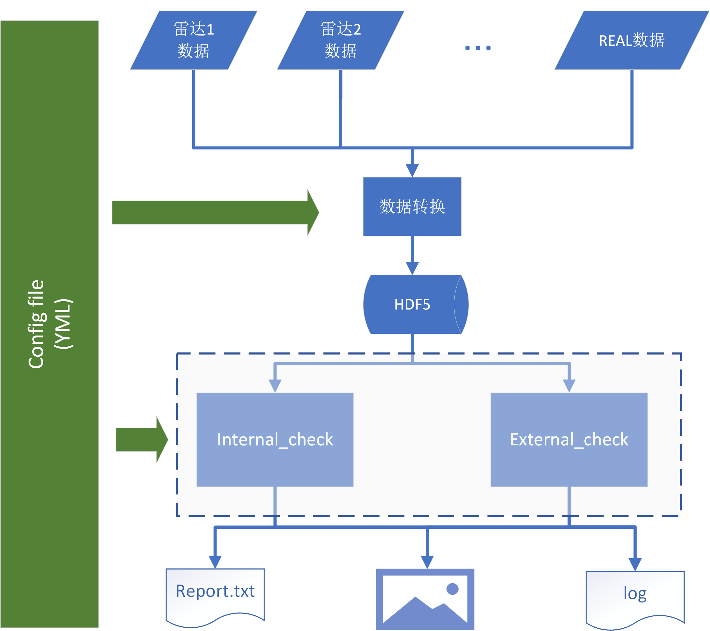

# 气象局激光雷达对比程序

本项目提供用于气象局激光雷达对比所需的所有数据分析代码。主要功能包括：

- 数据读取和转换
- 数据预处理
- 自对比验证
- 互对比验证

> 本项目基于**Matlab (b2017)**版本开发，对于低版本**Matlab**运行本项目出现的错误，作者本人概不负责。除此之外，因为**Matlab**对中文支持较差，在使用中请保证不要出现中文路径名。

## 代码下载

> 本代码所有版权归属本人（殷振平，邮箱<zp.yin@whu.edu.cn>）。没有本人允许禁止进行第三方分享。

[**Git**][1]是代码工程管理软件，推荐使用[**Git**][1]管理本代码库。可以在**Git Bash**中输入以下代码下载本代码库：

```bash
cd {/path/to/work_directory}   # 将{}内容换成你想要保存本代码库的路径
git clone https://gitee.com/mualidar/cma-lidar-comparison   # 可能需要输入你的Gitee账号和密码
```

运行完上述代码后，本代码库就会出现在你设定好的工作目录下

## 代码更新

本代码目前处在测试和更新中，可以通过在**Git Bash**中输入以下代码来更新你的本地代码库：

```bash
cd {/path/to/work_directory/cma-lidar-comparison}
git pull origin master
```

> 如果你对Git没有任何了解的话，在使用过程中请不要修改本项目的任何文件。

## 代码使用

整个对比代码的结构框图如下所示：

<p align='center'>

<br>
<b>程序整体结构图</b>

代码的所有功能通过配置文件进行控制，配置文件格式为[YAML][2]文件。通过**Matlab**版本的[YAML][2]文件解析库[yamlmatlab][3]可以将[YAML][2]文件解析成**Matlab**的结构体，利用这个结构体可以控制**Matlab**程序的运行。

打开**Matlab**，在**Matlab**命令行窗口中输入以下命令来使用雷达对比代码。

```matlab
cd {/path/to/work_directory/cma-lidar-comparison}
setupLEToolbox   % 将本项目相关代码添加进入Matlab搜索路径中

LEMain('/path/to/configFile', 'flagReadData', true, 'flagQL', true, 'flagDebug', false);   % 显示雷达数据快照，其中注意设置config文件的绝对路径
% LEMain的其他使用方法，请使用 help LEMain 查看
```

## Q&A （问题解答）

**怎么知道REAL数据拼接结果的好坏？**

```matlab
close all;
LEMain('D:\Coding\Matlab\lidar_evaluation_1064\config\test_REAL_signalMerge_config.yml', 'flagReadData', true, 'flagDebug', true, 'flagQL', true);
```

修改拼接系数的代码在`lidarPreprocess.m`中。

**怎么设置chTag（通道标识）**

在`config`文件设置通道标识需要按照实际数据中的通道顺序，通道类别标识代号可以参考[LidarList.md](lidarList.md)。

**各个配置参数的含义如何？**

关于配置参数的含义请参考[配置文件说明](docs/配置文件说明.pdf)

**各个版本的更新内容？**

关于各个版本的更新内容，请查看[CHANGELOG](CHANGELOG)

## 作者信息

殷振平，武汉大学遥感信息工程学院
邮箱：zp.yin@whu.edu.cn

[1]: https://git-scm.com/downloads
[2]: https://yaml.org/
[3]: https://code.google.com/archive/p/yamlmatlab/