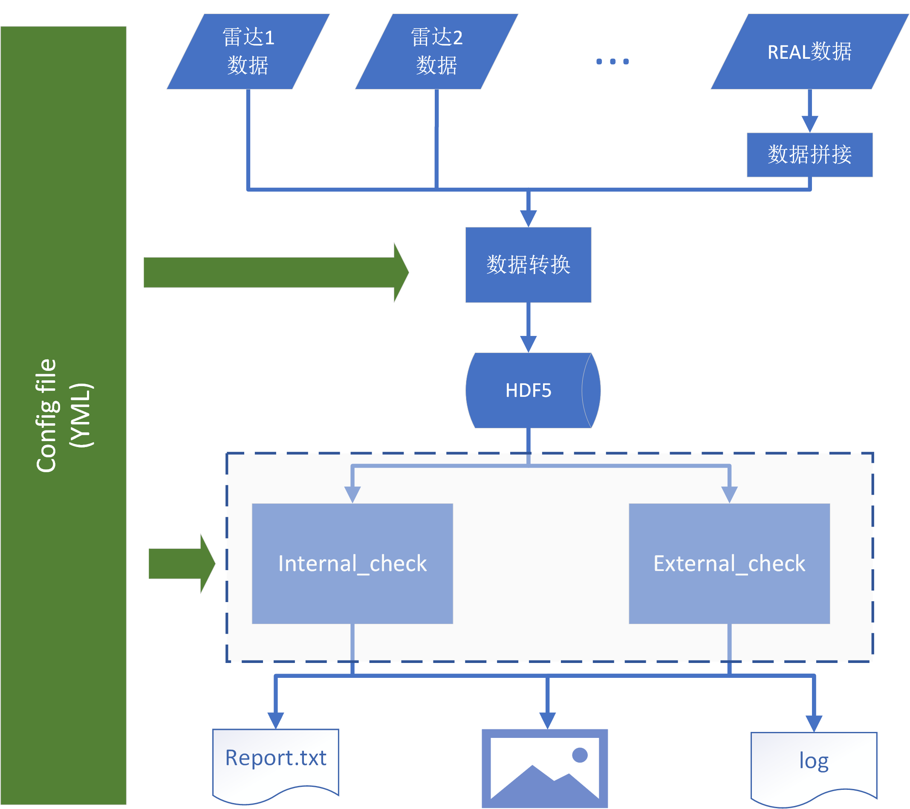

# 对比程序配置文件说明

## 配置文件类型说明

配置文件均为[`.yml`][1]格式文件。文件通过缩进（2个空格）区分不同层级的内容，每层缩进表示为上一对应层级的元素。文件通过`#`表示注释，`#`后的内容在解析文件时会被忽略。并且配置文件中的空行也会被解析器忽略。

配置文件中内容会被解析器解析成matlab可以识别的变量类型，如下所示：

```yaml
resultPath: D:\Users\zhenping   # 这个会被转变成matlab中resultPath字符串
result: 0.2                     # 这个会被转变成matlab中result的浮点型数值
results: [0.1, 0.2, 0.3]        # 这个会被转变成matlab中的results数组
resultPaths: ['D:\Users\zhenping', 'C:\Users\Yin']   # 这个会被转变成matlab中的元胞数组
resultPaths:                    # 这个也会被转变成matlab中的元胞数组（同上）
    - D:\Users\zhenping
    - C:\Users\Yin
results:                        # 这个会被转变成matlab中的matrix
    - [0, 1]
    - [2, 3]
resultsStruct:                  # 这个会被转变成matlab中的结构体，里面包含`results`和`resultPath`两个元素
    results: [0.1, 0.2, 0.3]
    resultPath: D:\Users\zhenping
```

> 使用过程中需要注意缩进等级，可以通过打开编辑器自带的空格显示来观察每一行的缩进。

## 配置文件内容说明

整个标定配置文件内容包括**整体配置**和单个**雷达配置**两种。**整体配置**对全体运行内容有效（必须设置），而**雷达配置**只对单个雷达有效（非必须设置）。

配置文件中的**整体配置**如下所示：

|变量名|意义|示例|
|:--:|:----|:--:|
|resultPath|所有对比结果保存目录|C:\Users\zhenping\cmp|
|dataSavePath|数据转换文件保存目录|C:\Users\zhenping\data|
|figFormat|输出图片文件格式|png（fig, jpg, or pdf）|

整体雷达功能如下图所示：

<p align='center'>

<br>
<b>程序整体结构图</b>

针对这些功能，配置文件被分为三大块，分别对应对比程序的三大功能，如下所示：

- 数据转换（dataLoaderCfg）
- 自对比（internalChkCfg）
- 互对比（externalChkCfg）

### dataLoaderCfg

数据转换配置负责将激光雷达二进制数据转换成**HDF5**数据格式文件，如下是将AW雷达数据转换的配置

```yaml
dataLoaderCfg:   # 注意相关缩进关系
  lidarList: ['AW']
  AW:
    dataPath: D:\Data\CMA_Lidar_Comparison\externalChk\AW
    dataFilenamePattern: .*Lidar.*
    dataFormat: 3
    chTag: ['532p', '532s']
    nMaxBin: 1800
    nBin: 4000
    flagFilenameTime: true
```

相关配置说明如下：

|变量名|意义|示例|
|:--:|:----|:--:|
|lidarList|需要进行数据转换的雷达列表，在表换列表中的雷达必须进行数据读取进行配置，否则程序会报错|['AW']|
|{AW}|雷达名称简写（跟lidarList相对应）|AW|
|dataPath|雷达数据文件目录|D:\Data\CMA_Lidar_Comparison\externalChk\AW|
|dataFilenamePattern|雷达数据文件过滤关键字（修改该过滤设置需要有开发人员指导，否则会导致不符合预期的运行结果）|.* Lidar .*（文件名包含Lidar的数据文件)|
|dataFormat|雷达数据格式： <p>1: 武汉大学标准1064 nm激光雷达数据</p> <p>2: 武汉大学小型1064 nm激光雷达数据</p> <p>3: 中国气象局二进制数据 (老版本)</p> <p>4: 大舜海雾激光雷达数据</p> <p>5: REAL数据</p>  <p>6: 中国气象局二进制数据 (新版本2021年)</p>  <p>7: ALA采集卡一般数据格式</p>|3|
|chTag|雷达数据通道标识 # 355e; 355p; 355s; 387; 407; 532e; 532p; 532s; 607; 1064e; 1064p; 1064s; 532pl; 532sl; 607l; 532ph; 532sh; 607h;（参考*lidarList.pdf*）|['532p', '532s']|
|nMaxBin|单剖面有效距离门个数|1800|
|nBin|从数据文件中读取的最大距离门数|2000|
|flagFilenameTime|是否从数据文件的文件名中获取数据剖面时间 （true or false）|true|

### 自对比（internalChkCfg）

自对比配置负责控制自对比的分析过程，如下是将WH1雷达进行自对比的配置:

```yaml
internalChkCfg:
  lidarList: ['WH1']
  WH1:
    lidarNo: 12   # lidar number. (see ./docs/lidarList.md)
    chTag: ['1064e']
    figVisible: 'on'   # whether display figures
    preprocessCfg:
      hOffset: 0   # height offset. (m)
      tOffset: 0   # time offset. (min)
      deadTime: []   # deadtime (ns). If it's empty, deadtime correction is disabled.
      bgBins: [1500, 2000]   # [start index, stop index] for background correction
      nPretrigger: 15   # if nPretrigger < 0, move signal up
      bgCorFile: ''   # data file of dark measurement results
      overlapFile: ''
    fullOverlapHeight: 400   # minimum height with complete overlap. (m)
    flagRetrievalChk: false   # backscatter retrieval check
    flagSaturationChk: false   # signal saturation check
    flagQuadrantChk: false   # quadrant check
    flagOverlapChk: false   # overlap evaluation
    flagRayleighChk: false   # Rayleigh fit check
    flagBgNoiseChk: false   # background noise check
    flagDetectRangeChk: false   # detection ability check
    flagContOptChk: true   # continuous operation check
    contOptChkCfg:
      deltaT: 1   # temporal resolution (min)
      nMinProfile: 1440   # minimum profiles required
      tRange: '2021-09-28 12:00:00 ~ 2021-09-29 12:00:00'
      hRange: [0, 13000]
      cRange:   # color range for Range-corrected signal
        - [0, 0.2e10]
```

相关配置说明如下：

|变量名|意义|示例|
|:--:|:----|:--:|
|lidarList|需要进行数据转换的雷达列表，相关雷达需要进行配置，否则程序会报错|['WH1']|
|{WH1}|雷达名称简写（跟lidarList相对应）|AW|
|lidarNo|雷达编号，参考*lidarList.pdf*，雷达编号用于区分雷达系统，是唯一已知的雷达系统标识，本软件内部已经根据已有的雷达标识内置了最优的雷达数据预处理算法，对于没有出现在雷达列表的设备，请咨询软件开发人员|12|
|chTag|雷达数据通道标识 # 355e; 355p; 355s; 387; 407; 532e; 532p; 532s; 607; 1064e; 1064p; 1064s; 532pl; 532sl; 607l; 532ph; 532sh; 607h;（参考lidarList.pdf）|['532p', '532s']|
|figVisible|是否展示matlab图形，on or off|on|
|preprocessCfg|激光雷达数据预处理配置，这行以下的缩进内容为雷达预处理设置||
|hOffset|高度偏移（米）|0|
|tOffset|时间偏移（分钟）|0|
|deadTime|死时间，需要对chTag对应的通道进行配置；如果死时间为空数组，则不进行死时间修正|[]|
|bgBins|背景距离门位置范围|[1500， 2000]|
|nPretrigger|预触发距离门个数|0|
|bgCorFile|背景修正数据文件路径，如为空，则不进行暗噪声背景修正|''|
|overlapFile|重叠因子文件名，如为空，则不进行重叠因子修正。重叠因子全部存储在`lib\overlap`文件夹中|''|
|fullOverlapHeight|完全进入视场高度，单位：米|400|
|flagRetrievalChk|是否验证反演算法，true or false。若为true，则需要进行相关设置|false|
|flagSaturationChk|是否进行线性度测试,true or false。若为true，则需要进行相关设置，参考其他telecover_test的配置文件|false|
|flagQuadrantChk|是否进行四象限测试，true or false。若为true，则需要进行相关设置，参考相关配置文件|false|
|flagOverlapChk|是否进行重叠因子测试，true or false。若为true，则需要进行相关设置，参考相关配置文件|false|
|flagRayleighChk|是否进行瑞利测试，true or false。若为true，则需要进行相关设置，参考相关配置文件|false|
|flagBgNoiseChk|是否进行背景噪声测试，true or false。若为true，则需要进行相关设置，参考相关配置文件|false|
|flagDetectRangeChk|是否进行探测范围测试，true or false。若为true，则需要进行相关设置，参考相关配置文件|false|
|flagContOptChk|是否进行连续观测测试，true or false。若为true，则需要进行相关设置，参考相关配置文件|false|
|flagWVChk|是否进行水汽通道测试，true or false。若为true，则需要进行相关设置，参考相关配置文件|false|

### 互对比（internalChkCfg）

互对比配置负责控制自对比的分析过程，如下是将WH1和WH2雷达进行互对比的配置:

```yaml
externalChkCfg:
  figVisible: 'on'   # whether display figures
  WH1:
    lidarNo: 12   # lidar number. (see ./docs/lidarList.md)
    chTag: ['1064e']
    fullOverlapHeight: 400   # minimum height with complete overlap. (m)
    overlapFile: ''
    hOffset: 0   # height offset. (m)
    tOffset: 0   # time offset. (min)
    deadTime: []   # deadtime (ns). If it's empty, deadtime correction is disabled.
    bgBins: [1500, 2000]   # [start index, stop index] for background correction
    nPretrigger: 15   # if nPretrigger < 0, move signal up
    bgCorFile: ''   # data file of dark measurement results
  WH2:
    lidarNo: 13   # lidar number. (see ./docs/lidarList.md)
    chTag: ['1064e']
    fullOverlapHeight: 200   # minimum height with complete overlap. (m)
    overlapFile: ''
    hOffset: 0   # height offset. (m)
    tOffset: 0   # time offset. (min)
    deadTime: []   # deadtime (ns). If it's empty, deadtime correction is disabled.
    bgBins: [1100, 1250]   # [start index, stop index] for background correction
    nPretrigger: 0   # if nPretrigger < 0, move signal up
    bgCorFile: ''   # data file of dark measurement results
  flagRangeCmp: false
  flagRCSCmp: true
  flagVDRCmp: false
  flagFernaldCmp: false
  flagRamanCmp: false
  rangeCmpCfg:   # 1064
    LidarList: ['WH1', 'WH2']   # lidar in comparison (1: standard lidar)
    tRange: '2021-09-27 19:30:00 ~ 2021-09-27 19:35:00'
    hRange: [6000, 15000]
    fitRange: [8000, 12000]
    normRange: [2500, 3000]
    sigRange: [0, 3e10]
    sigCompose:  # 1064
      - [1]   # first lidar
      - [1]   # second lidar
    maxRangeDev: 15   # (m)
```

相关配置说明如下：

|变量名|意义|示例|
|:--:|:----|:--:|
|figVisible|是否展示matlab图形，on or off|on|
|flagRangeCmp|是否进行距离精度对比，true or false。若为true，则需要进行相关设置，参考相关配置文件|false|
|flagRCSCmp|是否进行距离修正信号对比，true or false。若为true，则需要进行相关设置，参考相关配置文件|false|
|flagVDRCmp|是否进行体退偏比对比，true or false。若为true，则需要进行相关设置，参考相关配置文件|false|
|flagFernaldCmp|是否进行Fernald反演算法结果对比，true or false。若为true，则需要进行相关设置，参考相关配置文件|false|
|flagRamanCmp|是否进行Raman反演算法结果对比，true or false。若为true，则需要进行相关设置，参考相关配置文件|false|


[1]: https://yaml.org/