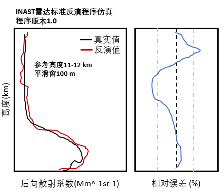
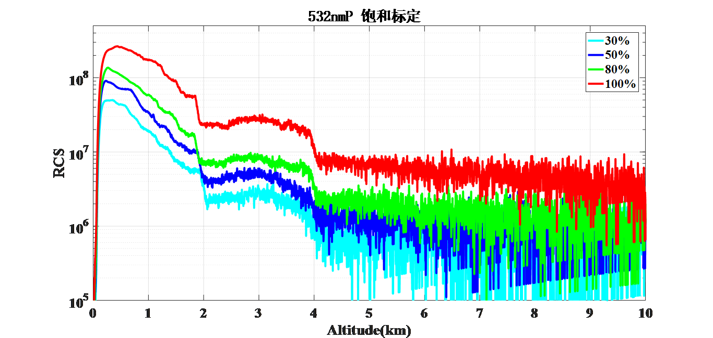
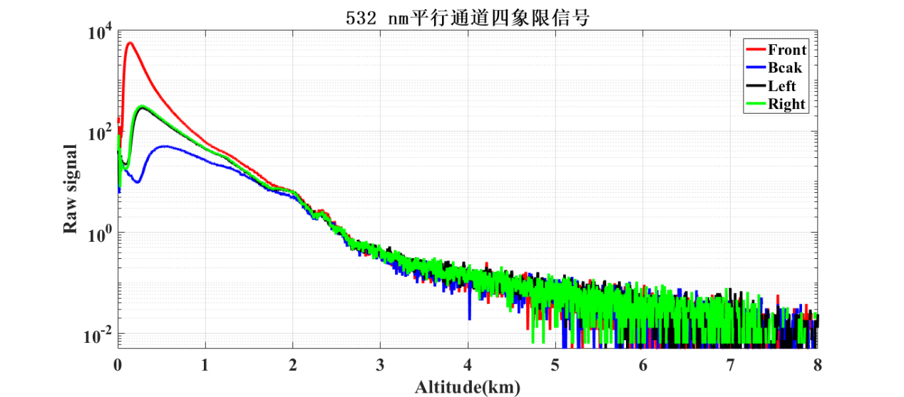
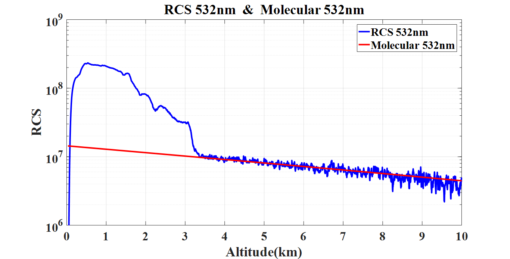

# 1064 nm激光雷达对比程序

## 整体需求

根据对激光雷达对比的需求可以将整体任务分为`自标定`和`对比标定`两种，其中`自标定`适用于雷达生产单位对雷达的自检，通过`自标定`可以确保雷达不存在较大的系统问题。在通过`自标定`后，可以设计定期开展`对比标定`，以便对雷达整体性能进行评估。

### 自标定

**光学参数反演算法标定**

以标准仿真信号作为输入，对比待标校的1064 nm气溶胶激光雷达的算法反演后向散射系数结果与标准仿真信号的后向散射系数的差异。

**系统线性度标定**

利用晚上大气较稳定情况，获取待校准雷达系统不加衰减片，以及分别增加透过率80%(OD 0.1)、50%(OD 0.3)、20%(OD 0.7)和10%(OD 1)的衰减片信号进行去背景距离订正后的数据。（每条信号廓线积分时间不超过2min）

**四象限均匀性标定**

获取待校准雷达系统不同象限回波信号去背景距离订正后的数据。（每个象限积分时间不超过2min）

**重叠因子标定**

获取待校准雷达的系统重叠因子结果（方法和实验条件根据系统自定义）。
试验待定，取决于大气状况

**瑞利散射信号拟合标定**

在水平能见度不小于15 km且无风且稳定的天气条件下，采集大气数据，并进行背景扣除和距离平方修正。（积分时间不超过30min）

**暗噪声**

遮蔽望远镜，采集系统信号。（积分时间不超过30min）

**有效探测距离**

在水平能见度不小于15 km且无风且稳定的天气条件下，采集大气数据。（积分时间不超过5min）

**连续工作时间**

全激光功率运行

### 对比标定

**距离平方矫正信号标定**

在能见度不小于15 km，无风且稳定的天气条件下，待标定激光雷达与标准激光雷达开展比对。连续采集至少180min的原始数据，从中选出不少于连续30min气溶胶分布稳定的时间段，用原始采集数据得出原始信号廓线，对原始信号廓线进行累计平均、零点校正（如果采用光子计数采集则需进行死时间校正）、扣除背景、距离平方校正处理，获得距离平方校正信号。分别计算0.5km~2km和2km~5km的平均相对偏差和平均标准偏差。

**后向散射系数测量精度**

在能见度不小于15 km，无风且稳定的天气条件下，待测激光雷达和标准激光雷达垂直探测，避开云，开机运行。连续采集后获得至少30min米散射通道的原始采集数据，并使用统一的激光雷达比（如50sr）进行反演计算得到米散射通道的后向散射系数。分别计算0.5km~2km和2km~5km的平均相对偏差和平均标准偏差。

**距离测量精度**

在有薄云的天气情况下，开机运行。积分时间不超过1min。在系统指向和零点标定的基础上，采用标准气溶胶激光雷达的原始回波信号进行比对，抽取具有强散射薄云的测量区间，利用信号峰值位置作为比对标准，采用强度加权平均法计算云强度最高点高度，然后计算两者峰值位置的差别。

## 数据格式

## 方案设计

### 光学参数反演算法标定

输入EARLINET仿真信号，输入后向散射系数模块，得到后向散射系数，并和真实值进行对比，输出0.5-2km平均相对偏差（<=10%）和2-5km平均相对偏差（<=20%）。

输出图形示例



反演函数`./lib/retrieval/fernaldINAST.m`
对比函数`./lib/tests/test_fernaldINAST.m`

### 系统线性度

**标准文件输出**

将不同衰减对应的信号累加，预处理后输出为txt文件，文件名为

Xxxx_XIIiii_Xxxxx_SaturationCalibration_yyyymmddhhmmss_wavelength.txt

> Xxxx由气象局规定每个厂家的产品具体型号；XIIii各设备对应的编号；Xxxxx台站编号；wavelength为波长

数据文件内容如下：

``` txt
Range(m)	RCS_100 RCS_80 RCS_50 RCS_20 RCS_10
3.7500	46.2258	17.0892	35.2032	21.9329
7.5000	96.8074	22.3495	31.9453	22.5584
11.2500	181.3201	32.4140	41.6584	35.3155
15.0000	79.5861	23.7114	36.5226	26.5111
```

**输出结果**

判定指标为0.5-2km，平均相对偏差<=10%

输出图形示例



### 接收横截面四象限均匀性

**标准文件输出**

将望远镜分别遮住不同象限进行测量，将遮板顺时针或逆时针依次旋转0，90，180，270和360度。将每个角度对应的测量结果累加后输出到数据文件中，文件名为

Xxxx_XIIiii_Xxxxx_FourquadrantCalibration_yyyymmddhhmmss_wavelength.txt

数据文件内容如下

``` txt
Range(m)	Q1 Q2 Q3 Q4 **Q1***
3.7500	46.2258	17.0892	35.2032	21.9329	46.4532
7.5000	96.8074	22.3495	31.9453	22.5584	97.0074
11.2500	181.3201	32.4140	41.6584	35.3155	182.0101
15.0000	79.5861	23.7114	36.5226	26.5111	80.0120
18.7500	151.0844	17.5294	31.4671	22.8299	150.0144
22.5000	216.8045	20.5744	36.1720	29.2667	217.2033
26.2500	221.4621	19.1889	36.4300	26.3773	220.5221
30.0000	288.1238	19.9075	40.4218	29.0792	288.3438
33.7500	347.9699	18.0146	40.1571	28.5418	347.9800
37.5000	390.4311	18.4413	43.0848	29.1189	391.2311
41.2500	455.7370	19.6395	49.4717	33.3259	452.2350
45.0000	521.9779	19.8917	55.3425	36.2644	520.2779
```

**输出结果**

0和360度在2-4km的平均相对偏差小于10%
在2-4km高度段内至少有三个象限的信号平均相对偏差<=20%

输出图形示例



### 大气瑞利信号拟合一致性标定

**标准文件输出**

文件名

Xxxx_XIIiii_Xxxxx_RayleighCalibration_yyyymmddhhmmss_wavelength.txt

``` txt
Range(m) Mie_RCS  Molecular_RCS
3.7500	2633.9132	6904957.2369
7.5000	10728.7885	6813372.2635
11.2500	27135.2017	6723243.7311
15.0000	52833.0175	6634544.5611
18.7500	86148.3894	6547248.2436
22.5000	142505.4235	6461328.8236
26.2500	226687.1647	6376760.8888
```

**输出结果**

在拟合区域，相对偏差小于15%，且拟合区域宽度大于2km

输出图形示例



### 有效探测范围

选取数据直接计算信噪比，选取时间段不能超过5min

寻找信噪比大于3的高度段>=10km

图形：信号，信噪比剖面

### 暗噪声

**标准文件输出**

Xxxx_XIIiii_Xxxxx_ BackgroundNoise_yyyymmddhhmmss.txt

``` txt
Range(m)	 Channel1 Channel2 Channel3…….
3.7500	 4.4212  4.4212  4.4212……
7.5000	4.4638
11.2500	4.5511
15.0000	4.4995
18.7500	4.4291
22.5000	4.5000
26.2500	4.4789
30.0000	4.5036
33.7500	4.4639
37.5000	4.4655
41.2500	4.5022
45.0000	4.5033
48.7500	4.4819
52.5000	4.4364
56.2500	4.5023
60.0000	4.5114
```

**输出结果**

系统噪声小于随机噪声

### 连续工作时间

超过24h连续工作彩图

### 距离平方矫正信号精度标定

选取特定时间段，进行信号预处理，比对信号与标准信号的差异

**输出结果**

0.5-2km：平均相对偏差<=10%
0.5-2km：平均标准偏差<=10%
2-5km：平均相对偏差<=20%
2-5km：平均标准偏差<=20%


### 米散射气溶胶后向散射系数测量精度

累积时间30min，固定雷达比，反演得到后向散射系数

0.5-2km：平均相对偏差<=20%
0.5-2km：平均标准偏差<=20%
满足后向散射系数>0.1Mm-1sr-1，2-5km平均相对偏差<=40%，2-5km，平均标准差小于40%


### 距离测量精度

在有薄云情况下，积分时间不超过1min，高度偏差不超过15m（空间分辨率）

相关性检测。